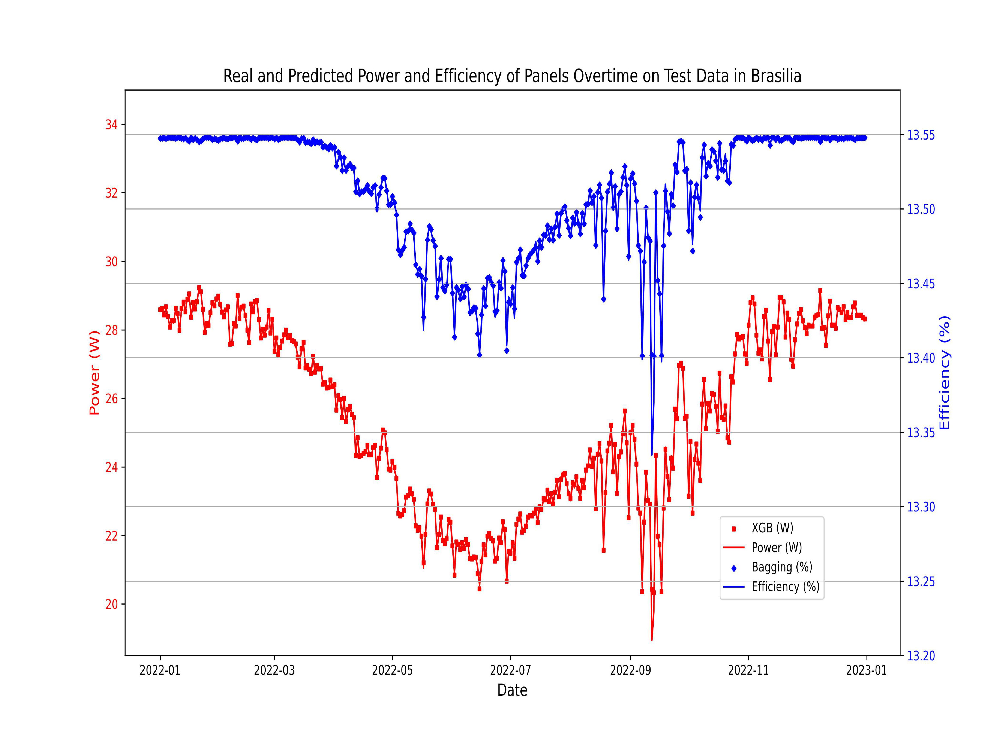

# Solar Power Forecasting Across the Continents using ML

## Overview
This project is dedicated to enhancing the performance prediction of solar PV-TE modules across different geographic locations. Utilizing advanced machine learning techniques, we aim to provide accurate predictions of power output and efficiency, contributing to the optimization of solar energy systems worldwide.

## Project Structure
```
ML4SOLAR/
├── backup/                     # Backup files and project versions
├── data/                       # Raw and processed datasets
│   ├── forecasting/           # Test datasets
│   │   ├── cleaned_forecasting_data_subset
│   │   ├── forecasting_data_power_eff_viz
│   │   └── raw_forecasting_data
│   │── learning/              # Training datasets
│   │   ├── cleaned_and_joined_full_files
│   │   ├── cleaned_and_joined_subset_files
│   │   ├── raw_files
│   │   └── train_data_power_eff_viz
│   └──data.md                 # data directory documentation
├── images/                    # Visualization outputs and charts
├── models/                    # Trained machine learning models
│   └──models.md                 # models directory documentation
├── notebooks/                 # Jupyter notebooks for analysis
│   ├── bestmodelvisual.py    # Model visualization scripts
│   └── ml4solar.ipynb       # Main analysis and ML modeling notebook
└── README.md                 # Project documentation
```

### Directory Descriptions

- **`backup/`**: Contains backup copies of important project files and previous versions for version control
- **`data/`**: Houses all datasets used in the project
  - **`forecasting/`**: Contains time series data specifically prepared for forecasting solar power output and efficiency predictions (2022 data precisely)
  - **`learning/`**: Contains processed datasets used for training machine learning models, including cleaned and joined datasets
  - [data.md](data/data.md): Contains training and forecasting dataset details as well as summary statistics
- **`images/`**: Stores all generated visualizations, charts, and plots from model performance and forecasting results
- **`models/`**: Contains all trained and saved machine learning models (ANN, SVR, XGB, LGBM, CatBoost, Bagging models) that can be loaded for inference and further analysis
   - [models.md](models/models.md): Contains information on model parameter descriptions
- **`notebooks/`**: Contains Jupyter notebooks and Python scripts for data analysis, model development, and visualization

## Methodology
We've employed a variety of regressive surrogate machine learning models including Artificial Neural Networks (ANN), Support Vector Regressors (SVR), Gradient Boosting (XGB, LGBM), CatBoost, and Bagging techniques. The models are trained on a rich dataset generated through finite element analysis, incorporating variables such as wind speed, solar irradiance, and ambient temperature. The Jupyter Notebook used for the ML modelling is provided [here](notebooks/ml4solar.ipynb).

## Results

### Performance Evaluation
Our models have been thoroughly evaluated, and the results highlight their ability to predict power and efficiency with high accuracy. We've summarized the performance of various models like ANN, SVR, XGB, LGBM, CatBoost, and Bagging across different countries in the bar chart below.


*Figure 1: Comparative analysis of machine learning models in predicting solar PV-TE module performance across multiple countries.*

### Model Forecasting Phase
The forecasting phase of our project involved using the optimally trained models to predict the power output and efficiency of solar PV-TE systems for datasets projected into the following year. These predictions are crucial for understanding future performance and planning accordingly.

#### Forecasted Power and Efficiencies
The forecasts display the expected power and efficiency trajectories over time, reflecting the impact of seasonal variations and other factors on the performance of the solar PV-TE systems.


*Figure 2: Forecasted power and efficiencies in Antarctica.*


*Figure 3: Forecasted power and efficiencies in Australia.*


*Figure 4: Forecasted power and efficiencies in Beijing.*


*Figure 5: Forecasted power and efficiencies in Berlin.*


*Figure 6: Forecasted power and efficiencies in Brasilia.*


*Figure 7: Forecasted power and efficiencies in Pretoria.*


*Figure 8: Forecasted power and efficiencies in Washington.*

These figures represent the predictive capabilities of our machine learning models over various locations, indicating robustness and reliability in diverse environmental conditions.

## Installation and Setup

### Prerequisites
- Python 3.7 or higher
- Jupyter Notebook
- Required Python packages (see requirements below)

### Required Libraries
```bash
pip install pandas numpy scikit-learn xgboost lightgbm catboost tensorflow matplotlib seaborn
```

### Getting Started
1. Clone this repository:
   ```bash
   git clone https://github.com/the-ailab/ml4solar
   cd ML4SOLAR
   ```

2. Install required dependencies:
   ```bash
   pip install -r requirements.txt
   ```

3. Launch Jupyter Notebook:
   ```bash
   jupyter notebook
   ```

4. Open `notebooks/ml4solar.ipynb` to explore the main analysis

## How to Use

### For Data Scientists and Researchers
To utilize these forecasting models, data scientists and solar energy analysts can:

1. **Load Pre-trained Models**: Access saved models from the `models/` directory for immediate inference
2. **Apply to New Data**: Use the trained models on your local datasets to predict future performance of solar PV-TE systems
3. **Customize Analysis**: Modify the notebooks to adapt the analysis for your specific geographic location or environmental conditions
4. **Extend Methodology**: Build upon the existing machine learning pipeline to incorporate additional features or model architectures

### Model Usage Example
```python
# Load a pre-trained model
import joblib
model = joblib.load('models/best_xgb_model.pkl')

# Preprocess the data with below function. Please ensure that you retain similar 3 columns as in the cleaned subset dataset


# Make predictions on new data
predictions = model.predict(your_data)
```

## Key Features
- **Multi-Continental Analysis**: Models trained and tested across diverse geographic locations
- **Multiple ML Algorithms**: Comprehensive comparison of various machine learning approaches
- **Time Series Forecasting**: Advanced forecasting capabilities for future performance prediction
- **Visualization Tools**: Rich set of charts and graphs for model interpretation
- **Reproducible Research**: Well-documented code and methodology for research reproducibility

## Data Sources
The project utilizes datasets generated through finite element analysis, incorporating environmental variables such as:
- Wind speed measurements
- Solar irradiance data
- Ambient temperature readings
- Geographic and temporal factors

## Future Work
- Integration of real-time weather data APIs
- Development of ensemble models for improved accuracy
- Extension to additional geographic locations
- Implementation of uncertainty quantification methods

## Contributions
Contributions to this project are welcome. If you have suggestions or want to improve the forecasting models, please:

1. Fork the repository
2. Create a feature branch (`git checkout -b feature/improvement`)
3. Make your changes and commit (`git commit -am 'Add new feature'`)
4. Push to the branch (`git push origin feature/improvement`)
5. Create a Pull Request

## License
This project is licensed under the MIT License - see the LICENSE file for details.

## Acknowledgements
We thank the contributors to the open-source machine learning libraries that have made this analysis possible, as well as the community of researchers dedicated to advancing renewable energy technologies. Special recognition goes to the developers of scikit-learn, XGBoost, LightGBM, CatBoost, and TensorFlow for providing robust machine learning frameworks.